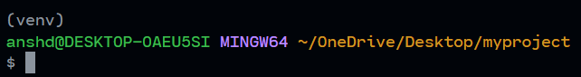

# prism

---

Temporary repository!

## Steps for using Flask

### Prerequisites

* Python 3.x

### Create an evironment

To create a virtual environment navigate to the project folder (here named as `prism`) using the terminal

```powershell
C:\some path> cd prism
```

or

```sh
user@linux: ~<some path>$ cd prism
```

Now execute the following command:

```sh
python3 -m venv venv
```

### Activate the environment

On Linux/Apple/Bash terminals

```sh
. venv/bin/activate
```

If installed via Command Prompt/Powershell (Windows)

```ps1
> cd venv/Scripts
> activate.bat
```

If active, the commandline would show `venv` in every new command line like so



or 


### Install Flask

```sh
pip install Flask
```

### Deactivate virtual environment

On Linux/Apple/Bash terminal

```sh
deactivate
```

On Command Prompt/Powershell (windows)

```ps1
cd venv/Scripts
deactivate.bat
```
